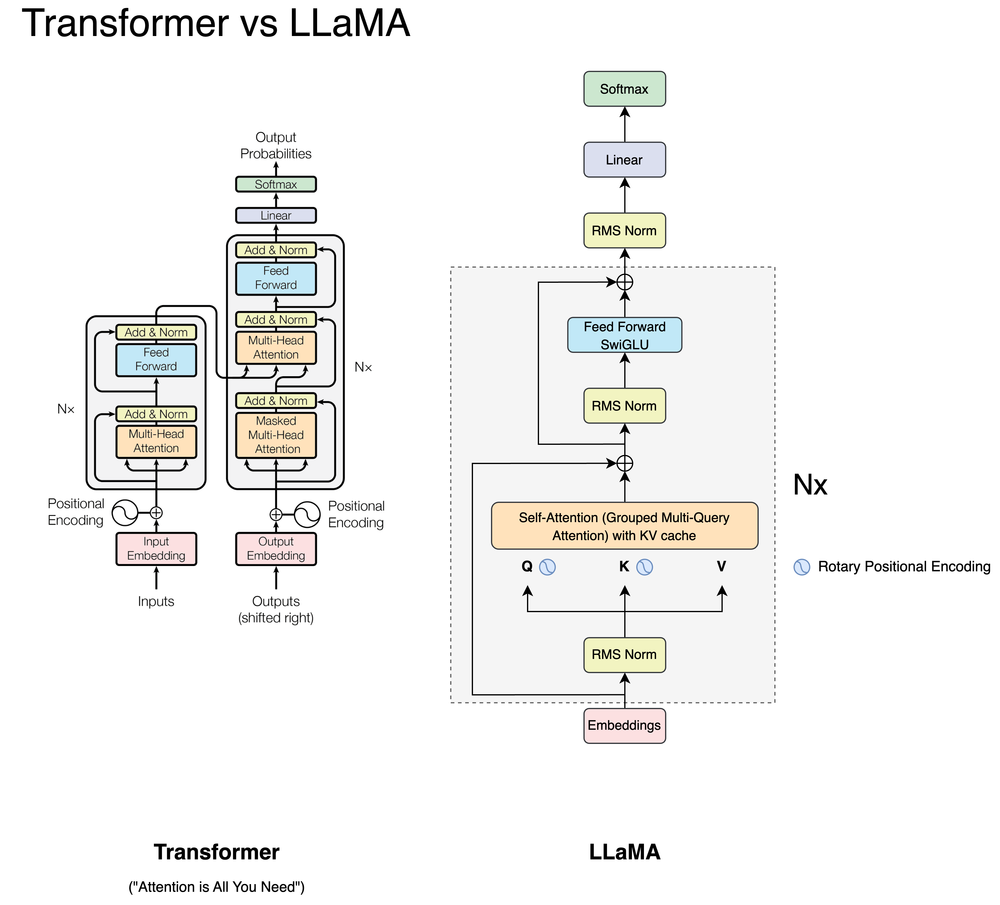

# 🦙 LLaMA 2 Implementation (Inference) 🦙

This is the implementation of the LLaMA 2 model by Meta.

## How to run?

Run the `download.sh` and input the presigned URL given by Meta after requesting for download access.

Refer to the official GitHub repository at this [link](https://github.com/facebookresearch/llama) to find out more.

Subsequently, input the model you'd like to download. The code written in this repository only works for the 7B LLaMA 2 model.
